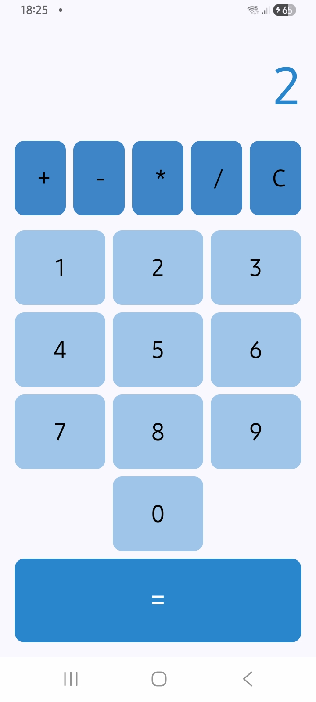

🧮 Calculadora - PDM II

Aplicativo de calculadora desenvolvido em Kotlin utilizando Jetpack Compose, como parte da disciplina Programação para Dispositivos Móveis II (PDM II), com o objetivo de aplicar conceitos de:

Interface declarativa com Compose
Gerenciamento de estado reativo
Implementação de regras de negócio

A aplicação permite realizar operações matemáticas básicas de forma simples e intuitiva.

- Funcionalidades

✔️ Interface 100% construída com Jetpack Compose

✔️ Visor dinâmico que atualiza em tempo real

✔️ Operações matemáticas básicas:

Adição (+)

Subtração (-)

Multiplicação (*)

Divisão (/)

✔️ Tratamento de erros básicos (ex: divisão por zero)

✔️ Manipulação de entrada do usuário (números e operadores)

Aplicações de calculadora geralmente seguem esse padrão de operações básicas como núcleo funcional .
A conta no projeto é realizada substituindo o número no visor, e não reproduzindo a conta por extenso. Após um operador ser selecionado, o número será substituido por 0, até que você selecione o próximo da operação.

🧠 Gerenciamento de Estado

O estado da aplicação é gerenciado utilizando recursos do Compose, como:

mutableStateOf

remember

Isso garante que o visor da calculadora seja reativo, atualizando automaticamente sempre que o usuário interage com os botões.

⚙️ Tecnologias Utilizadas

Kotlin

Jetpack Compose

Android Studio

Gradle

🚀 Como Executar

Clone o repositório:

git clone https://github.com/luizafonse/ATV1-PDMII-CALCULADORA

Abra o projeto no Android Studio

Execute em um emulador ou dispositivo físico

Desenvolvido por Afonso Luiz